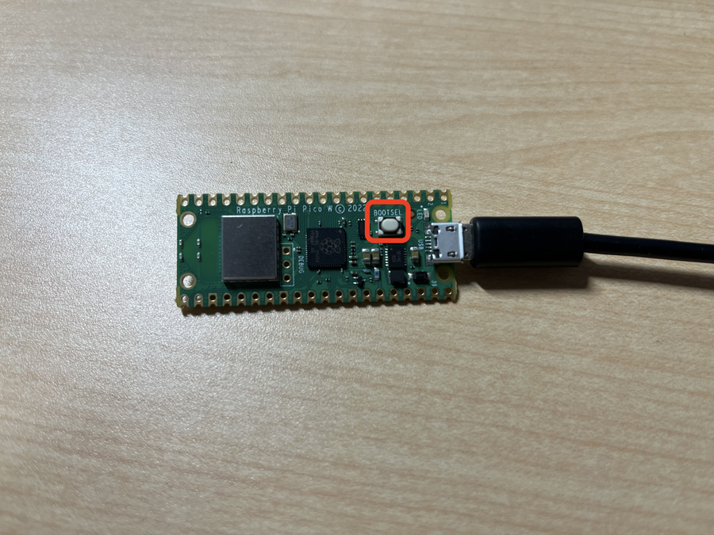
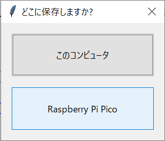

# 1. Pico Wのセットアップ

## Thonnyをインストール

今回はMicroPythonというプログラミング言語を使って，プログラミングをしていきます．
そのための実行環境として **Thonny** というソフトウェアを使用します．自分のパソコンのOSにあったものをインストールしましょう．

### Windows
[こちら](https://ksl.ci.kyutech.ac.jp/~iwai/thonny-4.1.4.exe)からダウンロードします．ダウンロードできたら`thonny-4.1.4.exe`をクリックして実行します．

<details>
<summary>Windows版Thonnyのインストール手順</summary>

1. Select setup Install Mode: `Install for me only (recommended)`を選択します．

2. Welcome to using Thonny!: `Next`をクリックします．

3. Lisense Agreement: `I accept the agreement`を選択し， `Next`をクリックします．

4. Select Destination Location: `Next`をクリックします．

5. Select Start Menu Folder: `Next`をクリックします．

6. Select Additional Tasks: `Create desktop icon`にチェックを入れて，`Next`をクリックします．

7. Ready to Install: `Install`をクリックします．

8.  Great success!: `Finish`をクリックします．

</details>

### macOS
Homebrewをインストールしている場合は以下のコマンドをターミナル.appで実行するとダウンロードできます．
```sh
brew install thonny
```
インストールしているかわからない場合は，[こちら](https://ksl.ci.kyutech.ac.jp/~iwai/thonny-4.1.4.pkg)からダウンロードします．ダウンロードできたら`thonny-4.1.4.pkg`をクリックして実行します．

### 起動
Thonnyのインストールが済んだら，起動してみましょう．初回起動時は以下のスクリーンショットのような画面が表示されます．


今回は「日本語」と設定した場合の画面で説明を行います．

<!-- ## picozeroライブラリをインストール

次にRaspberry Pi PicoのLEDなどを簡単に扱うためのライブラリである **picozero** をThonnyにインストールします．

1. メニューバーの **ツール** > **パッケージを管理** を開きます．

2. 検索欄に `picozero` と入力し，`PyPIを検索`をクリックします．

3. 検索結果の`picozero`をクリックします．
4. `インストール`をクリックします．
 -->

## Pico Wを接続

Pico Wとパソコンを接続します．

1. Pico WのUSB端子にMicro-USBケーブルを接続します．（**この段階ではまだパソコンとMicro-USBケーブルは接続しないでください**）

2. 写真の赤枠で囲んでいる`BOOTSEL`ボタンを押したままで，Micro-USBケーブルをパソコンと接続します．


3. 接続するとスクリーンショットのようなエクスプローラーのウィンドウが開きます．`BOOTSEL`ボタンを離します．エクスプローラーのウィンドウを閉じずに，次の節に移ります．


## ファームウェアを焼き込み

Pico WでMicroPythonを実行するためには，ファームウェアを書き込まなければいけません．

1. まずは[このリンク](https://rpf.io/pico-w-firmware)からファームウェアをダウンロードします．

2. 「Pico Wのセットアップ」の節で開いたエクスプローラーのウィンドウ（RPI-RP2）に`RPI_PICO_W-20240222-v1.22.2.uf2`をドラッグ&ドロップします．

3. `RPI_PICO_W-20240222-v1.22.2.uf2`のコピーが完了したら，Thonnyを開きます．

4. 右下の`ローカルPython3・ThonnyのPython`をクリックして，スクリーンショットのように`MicroPython (Raspberry Pi Pico)`を選択します．


ここまでで，環境構築が完了しました．次の節からは実際にMicroPythonのプログラムを実行してみます．

## Lチカ (local)

1. まずは，Pico WについているLEDを点滅させてみます．`pico_led.on()`でLEDを点灯，`pico_led.off()`でLEDを消灯できます．以下のプログラムをコピーして，Thonnyにペーストします．

```python
import machine
import time

led = machine.Pin("LED", machine.Pin.OUT)

while (True):
    led.on()
    time.sleep(0.5)
    led.off()
    time.sleep(0.5)
```

2. ペーストして，メニューバーの下の左から3つ目のフロッピーディスクのアイコンをクリックします．


3. 「どこに保存しますか？」と聞かれるので `Raspberry Pi Pico` を選択します．



4. ファイル名は`led1.py`など任意の名前をつけて保存します．
> [!IMPORTANT]
> 末尾に`.py`を忘れずにつけます．
5. メニューバーの下の左から4つ目のアイコンをクリックして，プログラムを実行します．
 

6. LEDが点滅したかと思います．実行を停止したい場合は右から2つ目のアイコンをクリックして，実行を停止します．


> [!IMPORTANT]
> Windows版Thonnyで 6. の操作を行い，ファイルの編集，保存を行おうとした時に以下のようなエラーが出る場合があります．その際はもう一度`STOP`のアイコンをクリックすることで保存や実行などができるようになります．
> 
## Lチカ (Wi-Fi)

この節でこの章は最後になります．最後はPico Wの上でWebサーバを動かして，そのWebページにアクセスしてLEDの点灯・消灯を制御します．

前節と同様に以下のプログラムをコピーして，Thonnyにペースト，保存，実行してください．
```python
import network
import socket
from time import sleep
import machine

ssid = "KIT-EVENT"
# passwordの値を書き換えます
password = "パスワードを入力"

led = machine.Pin("LED", machine.Pin.OUT)

def serve(connection):
    # Webサーバを起動
    state = "OFF"
    led.off()
    while True:
        client = connection.accept()[0]
        request = client.recv(1024)
        request = str(request)
        try:
            request = request.split()[1]
        except IndexError:
            pass
        if request == "/lighton?":
            led.on()
            state = "ON"
        elif request =="/lightoff?":
            led.off()
            state = "OFF"
        html = webpage(state)
        client.send(html)
        client.close()

def webpage(state):
    # HTMLのテンプレート
    html = f"""
            <!DOCTYPE html>
            <html>
            <form action="./lighton">
            <input type="submit" value="Light on" />
            </form>
            <form action="./lightoff">
            <input type="submit" value="Light off" />
            </form>
            <p>LED is {state}</p>
            </body>
            </html>
            """
    return str(html)

def open_socket(ip):
    # 接続の受付
    address = (ip, 80)
    connection = socket.socket()
    connection.bind(address)
    connection.listen(1)
    return connection

def connect():
    # Wi-Fiに接続
    wlan = network.WLAN(network.STA_IF)
    wlan.active(True)
    wlan.connect(ssid, password)
    while wlan.isconnected() == False:
        print("Waiting for connection...")
        sleep(1)
    ip = wlan.ifconfig()[0]
    print(f"Connected on {ip}")
    return ip

try:
    ip = connect()
    connection = open_socket(ip)
    serve(connection)
except KeyboardInterrupt:
    machine.reset()
```

実行すると，スクリーンショットのように`Connected on XXX.XXX.XXX.XXX`と表示されたかと思います．


その`XXX.XXX.XXX.XXX`という数字とピリオドで構成された文字列を，ブラウザのアドレスバー（普段`google.com`などと入力するところ）に入力します．

そうするとスクリーンショットのようなページが開きます．`Light on`もしくは`Light off`のボタンをクリックすると，LEDの点灯・消灯を制御できます．


[目次に戻る](README.md)