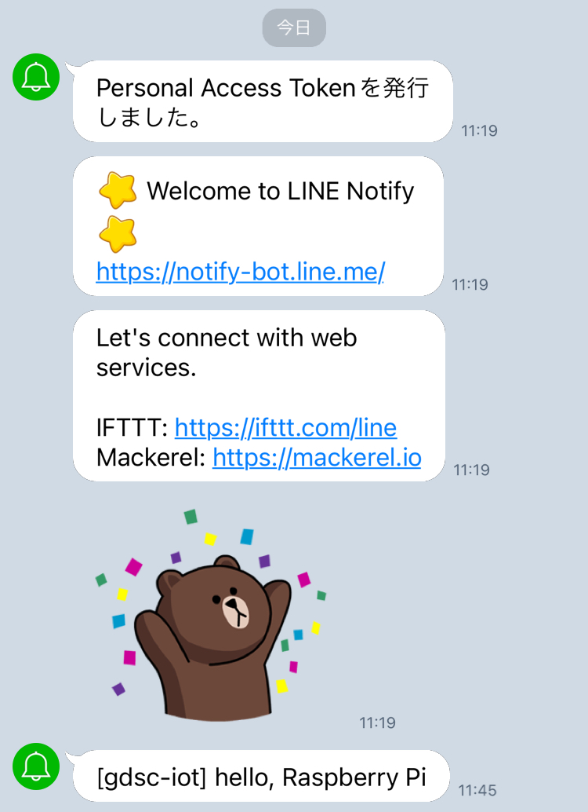

# 2. LINE Notify を利用した簡易Botの開発

## LINE Notify アクセストークンの取得

### 1. LINE Notify にログイン

[LINE Notify](https://notify-bot.line.me/ja/) にアクセスし、右上のボタンからログインします。

ログイン後、右上の自分の名前をクリックし、`マイページ` を選択します。

### 2. LINE Notify トークンの取得

`アクセストークンの発行(開発者向け)` から `トークンを発行する` を選択します。

好きなトークン名を入力し、トークルームは `1:1でLINE Notifyから通知を受け取る` を選択し、`発行する` をクリックします。

トークンが発行されるので、コピーしておきます。

> [!CAUTION]
> トークンは他人に知られないように注意してください。

> [!TIP]
> トークンの再発行はできないため、ブラウザのタブを開いたままにしておくと便利です。
>
> トークンがわからなくなってしまった場合は、古いトークンを削除して新しいトークンを発行しましょう。

## 本体温度センサを利用した通知デモ

### 1. hello

1章で作成したコードをベースに、まずは文字列をLINEで送ってみましょう。

[フルバージョン](./code/2-hello.py)

```python
...
import urequests

# SSID, password, LINE Notify Token, 通知メッセージを設定してください
ssid = "ssid"
password = "password"
token = "token"
message = "hello, Raspberry Pi"


def connect():
    ...


def send_line(token, message):
    # LINE Notify APIを使ってメッセージを送信
    url = "https://notify-api.line.me/api/notify"
    headers = {
        "Authorization": "Bearer " + token,
        "Content-Type": "application/x-www-form-urlencoded"
    }
    data = "message=" + message
    response = urequests.post(url, data=data, headers=headers)
    if response.status_code == 200:
        print("Notification sent successfully")
    else:
        print("Failed to send notification, status code:", response.status_code)
    response.close()


try:
    ip = connect()
    while True:
        if rp2.bootsel_button() == 1:
            # LEDが光っている間はLINE送信中
            machine.Pin("LED", machine.Pin.OUT).on()
            send_line(token, message)
            machine.Pin("LED", machine.Pin.OUT).off()
except KeyboardInterrupt:
    machine.reset()
```

ssid, password, token, message を設定して、Thonnyで実行してみましょう。

本体のボタンを押すと、LINEにメッセージが送信されます。



> [!NOTE]
> 本体のボタンを押すと、LEDが光りながらメッセージ送信中であることを示します。
>
> 送信が完了するとLEDが消えます。
>
> LEDが消えない場合、メッセージ送信中にエラーが発生している可能性があります。
>
> Thonnyのコンソールにエラーメッセージが表示されているか確認してください。
>
> "Waiting for connection..." がずっと表示され続ける
> - SSID, passwordが間違っている可能性があります。
>
> Failed to send notification, status code:401
> - tokenが間違っている可能性があります。

### 2. 温度センサの値を通知

次に本体温度センサ（4ピン）の値を取得して、LINEで送信してみましょう。

[フルバージョン](./code/2-temp.py)

```python
...

def get_sensor_temp():
    sensor_temp = machine.ADC(4)
    conversion_factor = 3.3 / 65535
    reading = sensor_temp.read_u16() * conversion_factor
    temperature = 27 - (reading - 0.706)/0.001721
    return temperature


try:
    ip = connect()
    while True:
        if rp2.bootsel_button() == 1:
            # LEDが光っている間はLINE送信中
            machine.Pin("LED", machine.Pin.OUT).on()
            send_line(token, message + str(get_sensor_temp()))
            machine.Pin("LED", machine.Pin.OUT).off()
except KeyboardInterrupt:
    machine.reset()
```

大体の部屋の温度は27度前後ですが、実際の温度は部屋の環境によって異なります。（近くの人やスタッフに何度くらいが出力されたか聞いてみましょう！）

## (Optional) GPIOを利用した温度監視システムの構築


[目次に戻る](README.md)
